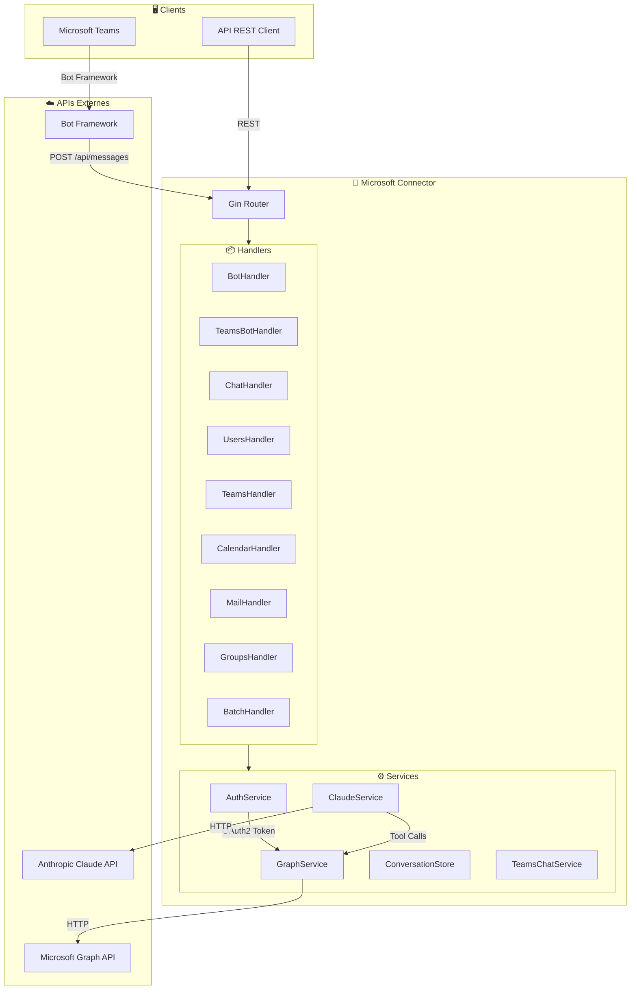
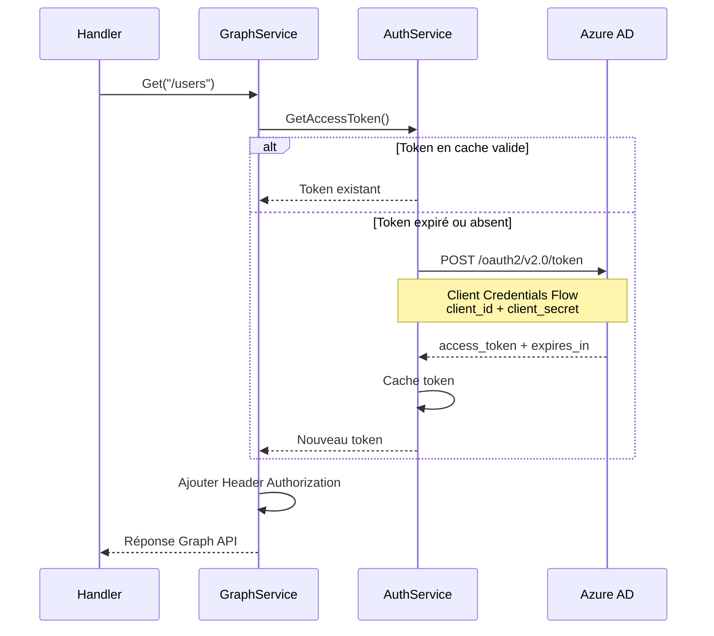
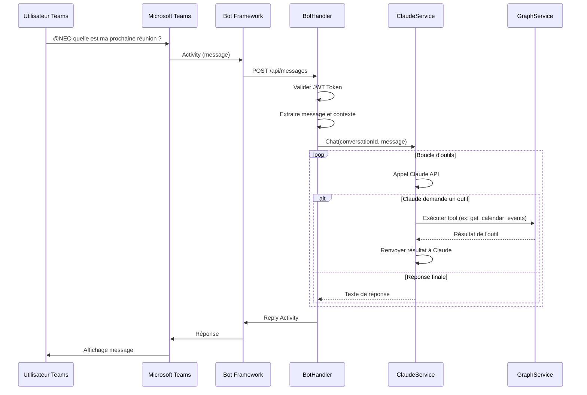
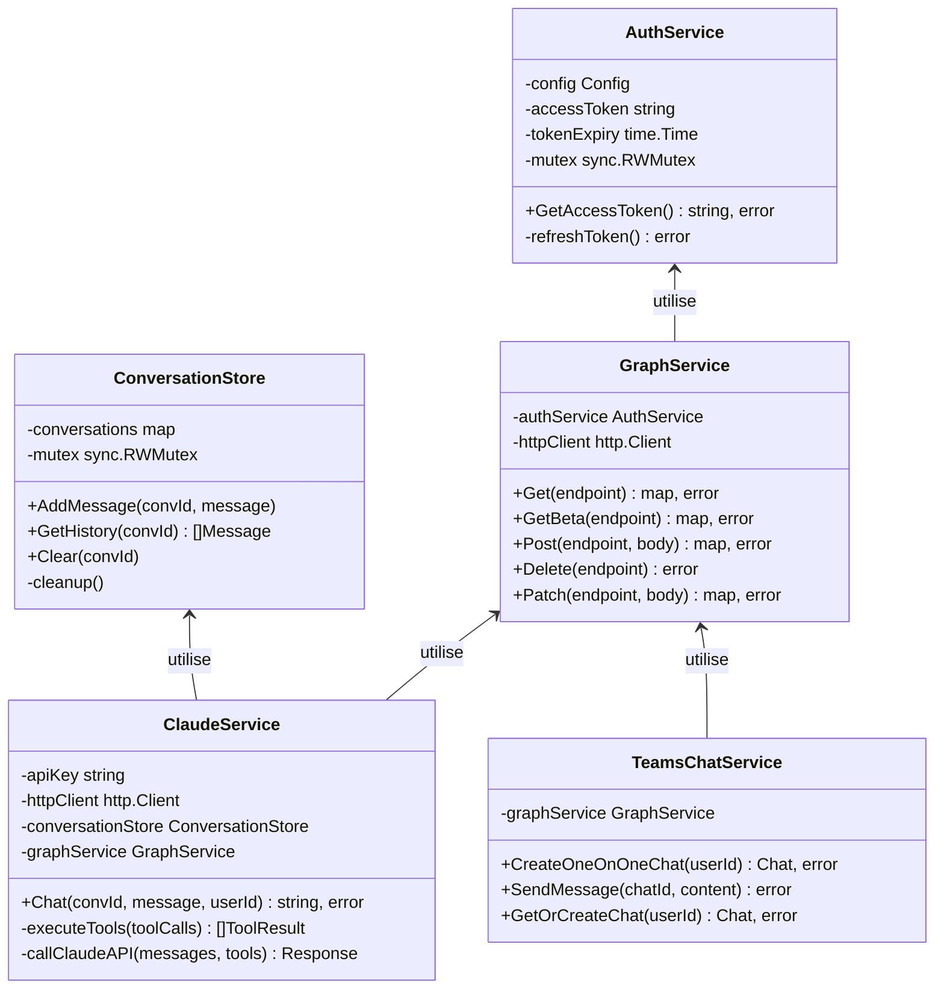
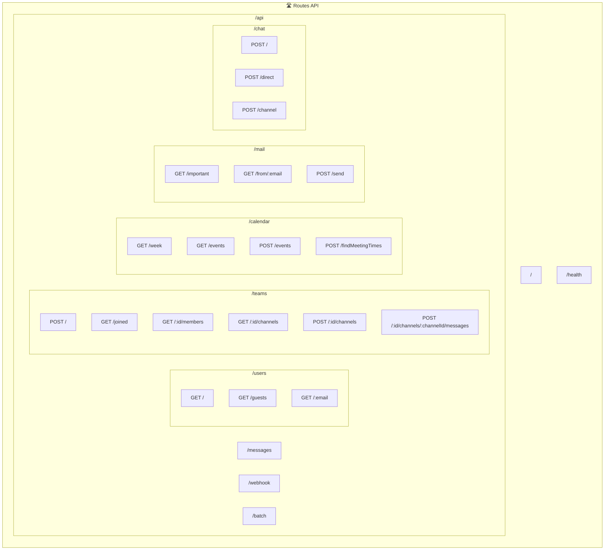
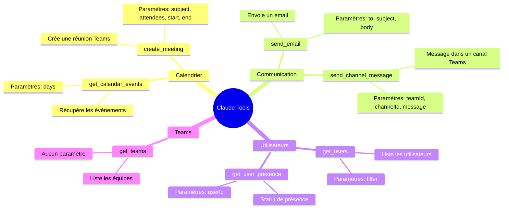
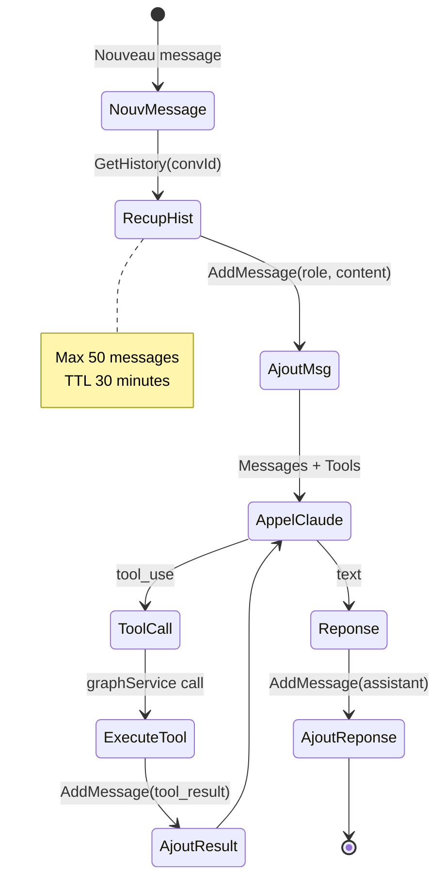
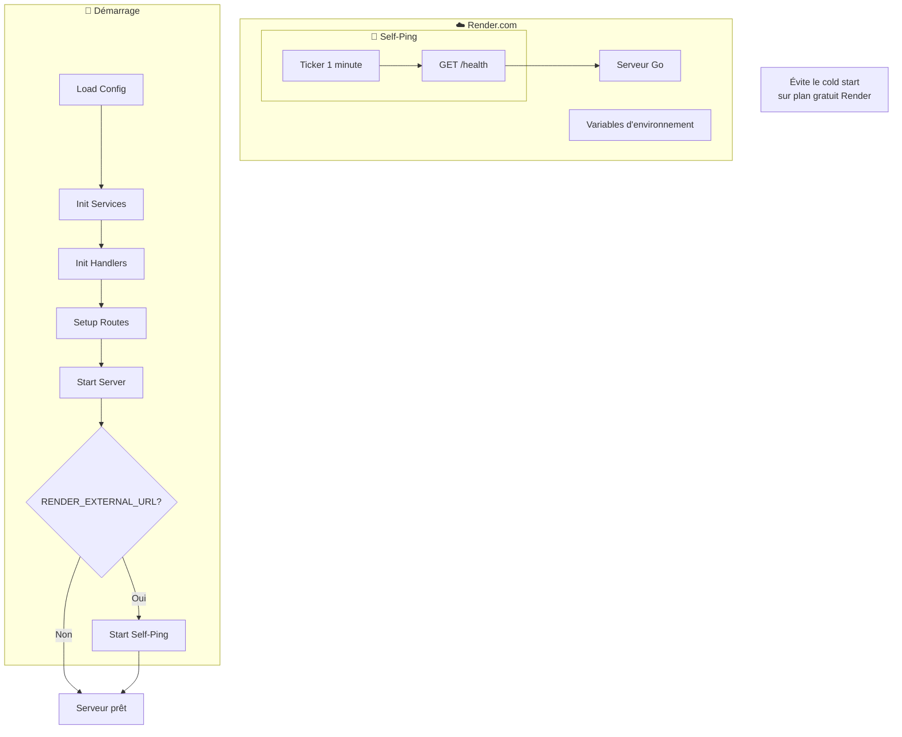
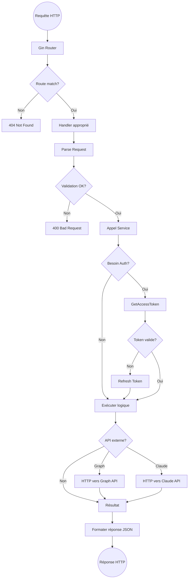

# Architecture Microsoft Connector

## 1. Vue d'ensemble de l'application

## 2. Flux d'authentification Microsoft

## 3. Flux du Bot Teams

## 4. Architecture des Services

## 5. Routes API

## 6. Outils Claude disponibles

## 7. Gestion des conversations

## 8. Flux de déploiement Render

## 9. Flux complet d'une requête

## 10. Structure des fichiers

```mermaid
flowchart TB
    subgraph PROJECT["📁 microsoft_connector"]
        subgraph CMD["cmd/"]
            MAIN["server/main.go<br/>🚀 Point d'entrée"]
        end
        
        subgraph CONFIG["config/"]
            CFG["config.go<br/>⚙️ Configuration"]
        end
        
        subgraph INTERNAL["internal/"]
            subgraph HANDLERS["handlers/"]
                H1["bot_handler.go"]
                H2["teams_bot.go"]
                H3["chat.go"]
                H4["users.go"]
                H5["teams.go"]
                H6["calendar.go"]
                H7["mail.go"]
                H8["groups.go"]
                H9["batch.go"]
                H10["teams_beta.go"]
            end
            
            subgraph SERVICES["services/"]
                S1["auth_service.go"]
                S2["graph_service.go"]
                S3["claude_service.go"]
                S4["claude_tools.go"]
                S5["conversation_store.go"]
                S6["teams_chat_service.go"]
            end
        end
        
        MANIFEST["teams-manifest/<br/>📋 Manifest Bot Teams"]
    end
    
    MAIN --> CFG
    MAIN --> HANDLERS
    HANDLERS --> SERVICES
```

---

## Résumé

| Composant | Rôle |
|-----------|------|
| **main.go** | Initialise tout et démarre le serveur |
| **AuthService** | Gère les tokens OAuth2 Microsoft |
| **GraphService** | Client HTTP pour Microsoft Graph |
| **ClaudeService** | Intégration IA avec boucle d'outils |
| **ConversationStore** | Mémoire des conversations |
| **Handlers** | Contrôleurs REST pour chaque domaine |
| **Bot Framework** | Communication avec Teams |