# Architecture Microsoft Connector

## 1. Vue d'ensemble de l'application

```mermaid
flowchart TB
    subgraph CLIENTS["🖥️ Clients"]
        TEAMS[Microsoft Teams]
        API_CLIENT[API REST Client]
    end

    subgraph CONNECTOR["🔌 Microsoft Connector"]
        GIN[Gin Router]
        
        subgraph HANDLERS["📦 Handlers"]
            BOT[BotHandler]
            TEAMS_BOT[TeamsBotHandler]
            CHAT[ChatHandler]
            USERS[UsersHandler]
            TEAMS_H[TeamsHandler]
            CAL[CalendarHandler]
            MAIL[MailHandler]
            GROUPS[GroupsHandler]
            BATCH[BatchHandler]
        end
        
        subgraph SERVICES["⚙️ Services"]
            AUTH[AuthService]
            GRAPH[GraphService]
            CLAUDE[ClaudeService]
            CONV[ConversationStore]
            TEAMS_CHAT[TeamsChatService]
        end
    end

    subgraph EXTERNAL["☁️ APIs Externes"]
        GRAPH_API[Microsoft Graph API]
        CLAUDE_API[Anthropic Claude API]
        BOT_FW[Bot Framework]
    end

    TEAMS -->|Bot Framework| BOT_FW
    BOT_FW -->|POST /api/messages| GIN
    API_CLIENT -->|REST| GIN
    
    GIN --> HANDLERS
    HANDLERS --> SERVICES
    
    AUTH -->|OAuth2 Token| GRAPH
    GRAPH -->|HTTP| GRAPH_API
    CLAUDE -->|HTTP| CLAUDE_API
    CLAUDE -->|Tool Calls| GRAPH
```

## 2. Flux d'authentification Microsoft

```mermaid
sequenceDiagram
    participant H as Handler
    participant GS as GraphService
    participant AS as AuthService
    participant AAD as Azure AD

    H->>GS: Get("/users")
    GS->>AS: GetAccessToken()
    
    alt Token en cache valide
        AS-->>GS: Token existant
    else Token expiré ou absent
        AS->>AAD: POST /oauth2/v2.0/token
        Note over AS,AAD: Client Credentials Flow<br/>client_id + client_secret
        AAD-->>AS: access_token + expires_in
        AS->>AS: Cache token
        AS-->>GS: Nouveau token
    end
    
    GS->>GS: Ajouter Header Authorization
    GS-->>H: Réponse Graph API
```

## 3. Flux du Bot Teams

```mermaid
sequenceDiagram
    participant U as Utilisateur Teams
    participant T as Microsoft Teams
    participant BF as Bot Framework
    participant B as BotHandler
    participant C as ClaudeService
    participant G as GraphService

    U->>T: @NEO quelle est ma prochaine réunion ?
    T->>BF: Activity (message)
    BF->>B: POST /api/messages
    
    B->>B: Valider JWT Token
    B->>B: Extraire message et contexte
    
    B->>C: Chat(conversationId, message)
    
    loop Boucle d'outils
        C->>C: Appel Claude API
        
        alt Claude demande un outil
            C->>G: Exécuter tool (ex: get_calendar_events)
            G-->>C: Résultat de l'outil
            C->>C: Renvoyer résultat à Claude
        else Réponse finale
            C-->>B: Texte de réponse
        end
    end
    
    B->>BF: Reply Activity
    BF->>T: Réponse
    T->>U: Affichage message
```

## 4. Architecture des Services

## 5. Routes API

```mermaid
flowchart LR
    subgraph ROUTES["🛣️ Routes API"]
        ROOT["/"]
        HEALTH["/health"]
        
        subgraph API["/api"]
            MESSAGES["/messages"]
            WEBHOOK["/webhook"]
            
            subgraph USERS_R["/users"]
                U1["GET /"]
                U2["GET /guests"]
                U3["GET /:email"]
            end
            
            subgraph TEAMS_R["/teams"]
                T1["POST /"]
                T2["GET /joined"]
                T3["GET /:id/members"]
                T4["GET /:id/channels"]
                T5["POST /:id/channels"]
                T6["POST /:id/channels/:channelId/messages"]
            end
            
            subgraph CALENDAR_R["/calendar"]
                C1["GET /week"]
                C2["GET /events"]
                C3["POST /events"]
                C4["POST /findMeetingTimes"]
            end
            
            subgraph MAIL_R["/mail"]
                M1["GET /important"]
                M2["GET /from/:email"]
                M3["POST /send"]
            end
            
            subgraph CHAT_R["/chat"]
                CH1["POST /"]
                CH2["POST /direct"]
                CH3["POST /channel"]
            end
            
            BATCH_R["/batch"]
        end
    end
```

## 6. Outils Claude disponibles

```mermaid
mindmap
  root((Claude Tools))
    Calendrier
      get_calendar_events
        Récupère les événements
        Paramètres: days
      create_meeting
        Crée une réunion Teams
        Paramètres: subject, attendees, start, end
    Communication
      send_email
        Envoie un email
        Paramètres: to, subject, body
      send_channel_message
        Message dans un canal Teams
        Paramètres: teamId, channelId, message
    Utilisateurs
      get_users
        Liste les utilisateurs
        Paramètres: filter
      get_user_presence
        Statut de présence
        Paramètres: userId
    Teams
      get_teams
        Liste les équipes
        Aucun paramètre
```

## 7. Gestion des conversations

## 8. Flux de déploiement Render

## 9. Flux complet d'une requête

## 10. Structure des fichiers

```mermaid
flowchart TB
    subgraph PROJECT["📁 microsoft_connector"]
        subgraph CMD["cmd/"]
            MAIN["server/main.go<br/>🚀 Point d'entrée"]
        end
        
        subgraph CONFIG["config/"]
            CFG["config.go<br/>⚙️ Configuration"]
        end
        
        subgraph INTERNAL["internal/"]
            subgraph HANDLERS["handlers/"]
                H1["bot_handler.go"]
                H2["teams_bot.go"]
                H3["chat.go"]
                H4["users.go"]
                H5["teams.go"]
                H6["calendar.go"]
                H7["mail.go"]
                H8["groups.go"]
                H9["batch.go"]
                H10["teams_beta.go"]
            end
            
            subgraph SERVICES["services/"]
                S1["auth_service.go"]
                S2["graph_service.go"]
                S3["claude_service.go"]
                S4["claude_tools.go"]
                S5["conversation_store.go"]
                S6["teams_chat_service.go"]
            end
        end
        
        MANIFEST["teams-manifest/<br/>📋 Manifest Bot Teams"]
    end
    
    MAIN --> CFG
    MAIN --> HANDLERS
    HANDLERS --> SERVICES
```

---

## Résumé

| Composant | Rôle |
|-----------|------|
| **main.go** | Initialise tout et démarre le serveur |
| **AuthService** | Gère les tokens OAuth2 Microsoft |
| **GraphService** | Client HTTP pour Microsoft Graph |
| **ClaudeService** | Intégration IA avec boucle d'outils |
| **ConversationStore** | Mémoire des conversations |
| **Handlers** | Contrôleurs REST pour chaque domaine |
| **Bot Framework** | Communication avec Teams |